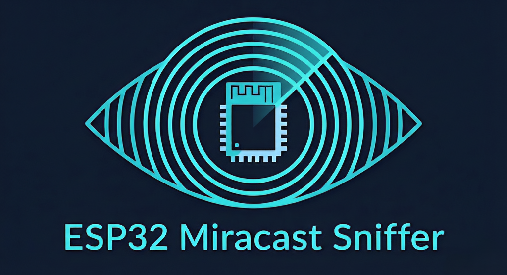

# ESP32 Miracast Sniffer


<p align="center">
  
</p>

**ESP32 Miracast Sniffer** is an **offline-first classroom tool** that captures  
Miracast / Wi-Fi Direct device names and links them to MAC addresses,  
helping teachers identify and handle inappropriate casting names on smart displays.

Developed by **0xDaVinci**  
GitHub: https://github.com/davinci0x01

---

## ✨ Features

- Works **completely offline** (no Internet required)
- Captures **Wi-Fi Direct / Miracast management frames**
- Links **multiple device names to a single MAC address**
- Supports **Arabic device names (UTF-8)**
- **Serial output only** (no server, no cloud, no data upload)
- Optional **Verification Mode** using a temporary Wi-Fi Access Point
- **One-click Web Installer** (no Arduino IDE required)
- Works on **ESP32-WROOM-32**

---

## 🌐 Web Installer (Recommended)

Flash the firmware directly from your browser using **one button only**.

👉 **Web Installer**  
https://davinci0x01.github.io/ESP32-Miracast-Sniffer/web-installer/

### Supported browsers
- Google Chrome  
- Microsoft Edge  

⚠️ Firefox is **not supported** (WebSerial limitation)

---

## 🔘 How the Installer Works

- The page shows **one single button**
- When pressed:
  1. Browser asks you to select the ESP32 USB/COM port
  2. The installer window opens automatically
  3. Firmware is flashed
  4. Available options (Erase / Serial) appear **inside the installer itself**

> You do NOT need to choose between “Install” or “Erase” on the page.  
> Everything is handled by the installer UI after connecting.

---

## 📟 Serial Monitor

### Baud Rate
115200

### 📱 Android (Mobile Users)

If you are using a phone, install:

**Serial USB Terminal**  
https://play.google.com/store/apps/details?id=com.serialcloud.usbterminal

✔ USB-OTG support  
✔ UTF-8 (Arabic names supported)  
✔ Works fully offline  

**Recommended settings**
- Encoding: UTF-8
- Line ending: Newline (`\n`)
- Baud rate: `115200`

---

## ⌨️ Serial Commands

| Command | Description |
|------|-----------|
| `r` | Print current report (MAC → names) |
| `c` | Clear all stored data |
| `p` | Pause / Resume sniffing |
| `v` | Enter verification mode (Wi-Fi AP) |
| `s` | Return to sniffing mode |
| `L` | List connected stations (verification mode) |
| `h` | Show help |

---

## 📊 Example Output

MAC 66:D0:D6:69:14:54
  - محمد (11)
  - اسم غير لائق (7)
  - 😂😂😂 (3)

This shows **multiple names used by the same device**.

---

## 🔍 Verification Mode (Optional)

Verification mode helps confirm a device **physically**.

How it works:
- Sniffing is paused
- ESP32 creates a **temporary Wi-Fi Access Point**
- Student is asked to connect manually
- Connected MAC address appears in Serial
- Teacher compares the MAC visually

⚠️ **Important**
Some phones use **randomized MAC addresses**.  
This is normal behavior and depends on device settings.

---

## ⚠️ Important Notes

- This tool does **NOT decrypt traffic**
- Does **NOT intercept private data**
- Does **NOT hack, attack, or disrupt networks**
- Captures **broadcast management frames only**
- Designed for transparency and safety

---

## 🎓 Intended Use

This project is designed for **educational and classroom environments**  
to help teachers manage inappropriate screen-casting behavior  
on smart displays that are **not connected to the Internet**.

---

## 📁 Repository Structure

```
ESP32-Miracast-Sniffer/
├── firmware/
│   ├── firmware.bin
│   ├── bootloader.bin
│   └── partitions.bin
│
├── web-installer/
│   ├── index.html
│   └── manifest.json
│
├── src/
│   └── ESP32_Miracast_Sniffer.ino
│
├── assets/
│   └── logo.png
│
└── README.md
```


---

## 📜 License

MIT License  
Free to use, modify, and share with attribution.

---

**Built with ❤️ by 0xDaVinci**
